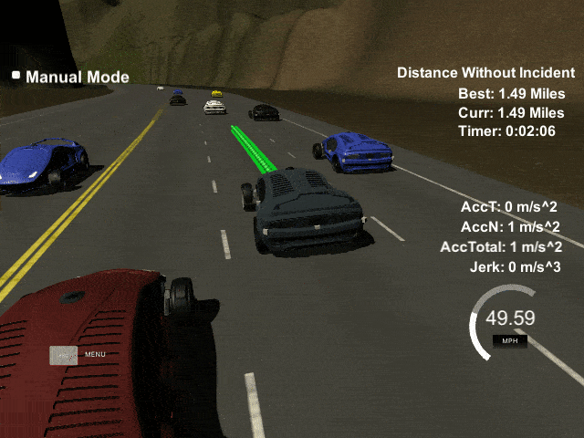
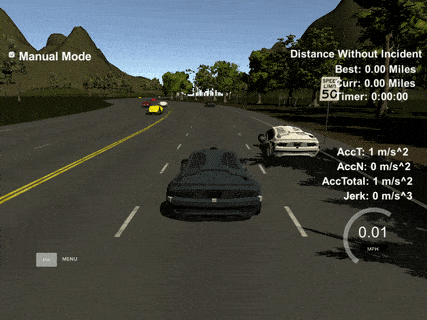
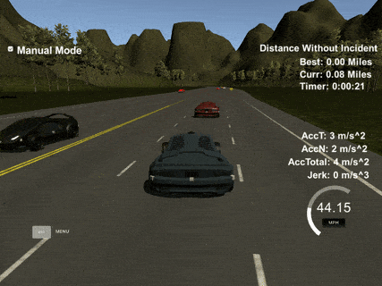
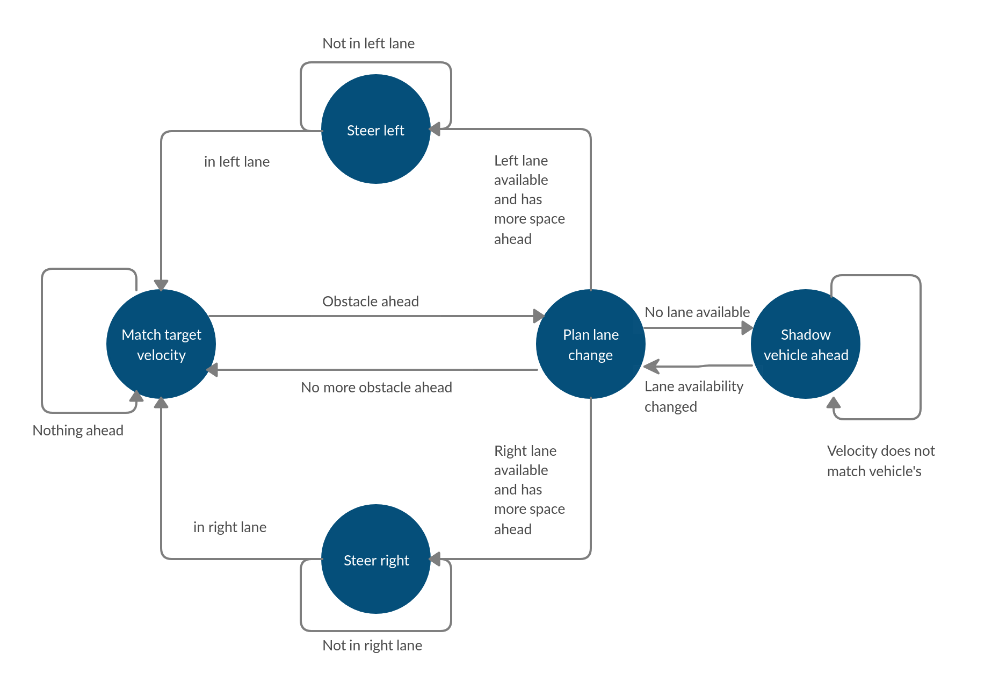
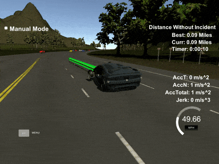
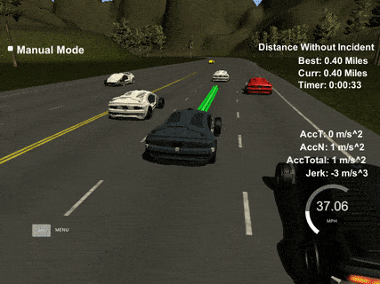

# Highway driving

[](LICENSE) [](https://www.codacy.com/manual/frgfm/sdcnd-path-planning?utm_source=github.com&amp;utm_medium=referral&amp;utm_content=frgfm/sdcnd-path-planning&amp;utm_campaign=Badge_Grade)  

Path planning project of Udacity Self-Driving Car Engineer (cf. [repo](https://github.com/udacity/CarND-Path-Planning-Project)).




## Table of Contents

- [Getting Started](#getting-started)
  - [Prerequisites](#prerequisites)
  - [Installation](#installation)
- [Usage](#usage)
- [Approach](#Approach)
- [Credits](#credits)
- [License](#license)


## Getting started

### Prerequisites

- [Unity3D](https://unity3d.com/get-unity/download): 3D game engine used for our simulation.
- make (>= 4.1 on Linux, Mac, >= 3.81 on Windows): the buildsystem of the project.
  - Linux: make is installed by default on most Linux distros
  - Mac: [install Xcode command line tools to get make](https://developer.apple.com/xcode/features/)
  - Windows: [Click here for installation instructions](http://gnuwin32.sourceforge.net/packages/make.htm)
- [cmake](https://cmake.org/install/) 3.5 (or newer): buildsystem generator.
  - Any OS: [click here for installation instructions](https://cmake.org/install/)
- [gcc](https://gcc.gnu.org/)/g++ 5.4 (or newer): to compile the C++ code.
  - Linux: gcc / g++ is installed by default on most Linux distros
  - Mac: same deal as make - [install Xcode command line tools](https://developer.apple.com/xcode/features/)
  - Windows: recommend using [MinGW](http://www.mingw.org/)
- [uWebSockets 0.13.0](https://github.com/uNetworking/uWebSockets/archive/v0.13.0.tar.gz): to handle our web-server.
  - Linux/Mac: [click here for installation instructions](https://github.com/uWebSockets/uWebSockets)
  - Windows: use either Docker, VMware, or even [Windows 10 Bash on Ubuntu](https://www.howtogeek.com/249966/how-to-install-and-use-the-linux-bash-shell-on-windows-10/) to install uWebSocketIO
- [json](https://github.com/nlohmann/json): to interact with JSON files *(header-only)*.
  - Any OS: place the [file](https://github.com/nlohmann/json/releases/download/v3.7.3/json.hpp) in the  `include/` folder
- [spline](https://kluge.in-chemnitz.de/opensource/spline/): for interpolation *(header-only)*.
  - Any OS: place the [file](https://kluge.in-chemnitz.de/opensource/spline/spline.h) in the  `include/` folder
- [Catch](https://github.com/catchorg/Catch2): for unittests *(header-only)*
  - Any OS: place the [file](https://github.com/catchorg/Catch2/releases/download/v2.11.3/catch.hpp) in the `lib/` folder
- [spdlog](https://github.com/gabime/spdlog): for console logging *(header-only)*
  - Any OS: extract the [archive](https://github.com/gabime/spdlog/archive/v1.5.0.tar.gz) and place the `include/spdlog` directory in the  `include/` folder

*Note: If you are running a Unix system, the installation scripts in the folder `scripts/` will install all the requirements apart from Unity3D. From the repository's main directory, run `bash scripts/install-linux.sh` for Linux or run `bash scripts/install-mac.sh` for MacOS to install those dependencies.*

### Installation

#### C++

Your folder hierarchy should look like below:

```
.
├── CMakeLists.txt
├── data
│   └── highway_map.csv
├── include
│   ├── json.hpp
│   ├── spdlog
│   └── spline.h
├── lib
│   └── catch.hpp
├── LICENSE
├── README.md
├── scripts
│   ├── format-project.sh
│   ├── install-cppdeps.sh
│   ├── install-linux.sh
│   └── install-mac.sh
├── src
│   ├── constants.hpp
│   ├── controller.cpp
│   ├── controller.h
│   ├── helpers.cpp
│   ├── helpers.h
│   ├── main.cpp
│   ├── perception.cpp
│   ├── perception.h
│   ├── planner.cpp
│   └── planner.h
├── static
│   └── images
└── test
    ├── helpers_test.cpp
    └── main_test.cpp
```

Now you can build the project:

```bash
mkdir build && cd build
cmake .. && make && cd ..
```


#### Unity

After installing Unity3D, you will need an environment build to run the simulation. Download the appropriate build for your OS and extract it:

- [Linux](https://github.com/udacity/self-driving-car-sim/releases/download/T3_v1.2/term3_sim_linux.zip)
- [Mac](https://github.com/udacity/self-driving-car-sim/releases/download/T3_v1.2/term3_sim_mac.zip)
- [Windows](https://github.com/udacity/self-driving-car-sim/releases/download/T3_v1.2/term3_sim_windows.zip)

If you encounter an issue with the above builds, please refer to the "Available Game Builds" section of this [readme](https://github.com/udacity/self-driving-car-sim).


## Usage

### Unittests

By compiling the project previously, you created 2 executables. One of them is here to run unittests using [Catch2](https://github.com/catchorg/Catch2). In order to run the tests, use the following command:

```bash
build/tests
```

which should yield something similar to:

```shell
===============================================================================
All tests passed (7 assertions in 4 test cases)
```


### Project build

Run the recently built project using the following command:

```
build/path_planning
```

The compiled program is now listening to events on port `4567` using a web server. We just need to run our Unity3D environment to see the results.

- Run the `term3_sim` executable after extracting the environment archive *(you might have to make it executable on Unix systems)*.
- Select the Resolution and Graphics settings for your setup.
- Click on `SELECT`


## Approach

This project involves an agent (vehicle on a highway) exposed to a continuous state space and continuous action space. The environment can be switched to manual mode to give controls to the user, by default the only accepted inputs are the Cartesian coordinates of next position in 2D.

### Environment

This Unity environment gives a large state space with inherent constraints on the agent state. 

| Compliant driving                         | Unwanted behaviour                                |
| ----------------------------------------- | ------------------------------------------------- |
|  |  |

In manual mode, if we violate common highway driving rules, warnings will be thrown. The environment will have the car position to strictly take values in what the controller sends and will expose both the agent state and sensor measurements to our C++ program.

Please refer to this [repository](https://github.com/udacity/self-driving-car-sim) for further details.


#### Input data

Localization data: cartesian position (x, y), [frenet](https://en.wikipedia.org/wiki/Frenet%E2%80%93Serret_formulas) position (s, d), angular orientation (yaw), and cartesian speed.


Sensor fusion data: for each vehicle in range, car unique ID, cartesian position (x, y), cartesian velocity (speed_x, speed_y), frenet position (s, d).

#### Environment interactions

Our vehicle will visit all received cartesian coordinates in the list every .02seconds.

#### Goals

- Respect speed limit of 50MPH

- Adopt a collision-free driving behaviour

- Ensure passenger comfort: total acceleration less than 10m/s2, jerk less than 10m/s3
- Respect all the above conditions during a full lap (6.946km, equivalent to 4.32 miles)


### Implementing the motion planning

Let us define our high-level motion planning using a [Finite State Machine](https://en.wikipedia.org/wiki/Finite-state_machine) (FSM).



The system's states are:

- Match target velocity: strive towards target speed (maximum allowed speed by default)



- Plan lane change: use sensor data to assess collision-free actions.
- Shadow vehicle ahead: match the speed of the vehicle ahead.



- Steer left/right.


In regards to the lap completion constraints, the "Match target velocity" is enforcing the speed limit compliance, the "Plan lane change" is in charge of ensuring collision-free behaviour, and the passenger comfort is handled by "Shadow vehicle ahead" (for acceleration) and "Steer left/right" (for jerk mainly).

The proposed implementation is described as follows:

1. **Perception**: leverage sensor fusion to get an accurate representation of nearby environment (distance to next front/rear vehicles and their velocity for each lane).
2. **Perception summary**: use perception information to determine which lanes are available and which lanes are accessible for maneuvers (transition to a further lane). By defining a front margin (default to 30m) and a rear margin (default to 5m), detecting no vehicle in this range makes the lane available. If there is no vehicle within half the front margin, it makes the lane accessible for transition maneuvers.
3. **Behavior planning**: if the current lane is not available, select among the available lanes (with accessible in-between lanes) the one with the highest front margin available. If the best lane requires a double lane change, we instead take the transition lane. At the next step, the perception will re-evaluate the nearby situation and validate this second lane change or take a better alternative.
4. **Trajectory generation**: compute next positions by interpolating between current state and target state (using [spline](https://kluge.in-chemnitz.de/opensource/spline/) for this implementation).


In the `src` folder, you will find:

- `main.cpp`: reads measurement data from Unity3D, runs the motion planning and sends next positions to environment.
- `perception.cpp`: analyzes nearby environment to determine lane availability (first part of "Plan lane change").
- `planner.cpp`: performs lane selection (second part of "Plan lane change").
- `controller.cpp`: execute velocity update and route interpolation.
- `helpers.cpp`: implements conversions for position coordinates, angles, and provides data reading utilities.


### Results

The previously mentioned implementation yields a smooth driving agent able to evolve in complex and dynamic situations. Below the next planned positions are marked in green.


The full-length lap recording is available for download in the release attachments:

- [Full lap recording](https://github.com/frgfm/sdcnd-path-planning/releases/download/v0.1.0/lap_recording.mp4)

## Limitations and improvements

A few aspects of the current implementations could be improved in the upcoming releases:

**Sudden lane change of front vehicles**: in some edge cases, front vehicles may suddenly change to our lanes while we are driving faster than them, which can cause a collision. By complying to jerk & acceleration limitations, the sudden planning has been quite efficient.

**360° trajectory prediction**: all objects in sensor range should have their trajectory predicted by using previous states. Using this, we can foresee velocity evolutions, lane changes and even collision between other vehicles. [Process modeling](https://d17h27t6h515a5.cloudfront.net/topher/2017/June/5953fc34_a-comparative-study-of-multiple-model-algorithms-for-maneuvering-target-tracking/a-comparative-study-of-multiple-model-algorithms-for-maneuvering-target-tracking.pdf) could be a good lead in this synthetic environment.

**Trajectory loss**: a comprehensive trajectory loss should incorporate both the environment constraints but also other vehicles' trajectories.


## Credits

This implementation is of my own design but widely uses the following methods and concepts:

- [Finite state machine](https://en.wikipedia.org/wiki/Finite-state_machine)
- [Frenet coordinates](https://en.wikipedia.org/wiki/Frenet%E2%80%93Serret_formulas)
- Polynomial Trajectory Generation: [Optimal Trajectory Generation for Dynamic Street Scenarios in a Frenet Frame (2010)](https://www.researchgate.net/publication/224156269_Optimal_Trajectory_Generation_for_Dynamic_Street_Scenarios_in_a_Frenet_Frame?enrichId=rgreq-cc1f37901f39b40cde2418fa1d4c8f58-XXX&enrichSource=Y292ZXJQYWdlOzIyNDE1NjI2OTtBUzoyMDMzNDQyMTI2OTcxMDlAMTQyNTQ5MjQ0Njg0Mw%3D%3D&el=1_x_3&_esc=publicationCoverPdf) 


## License

Distributed under the MIT License. See `LICENSE` for more information.